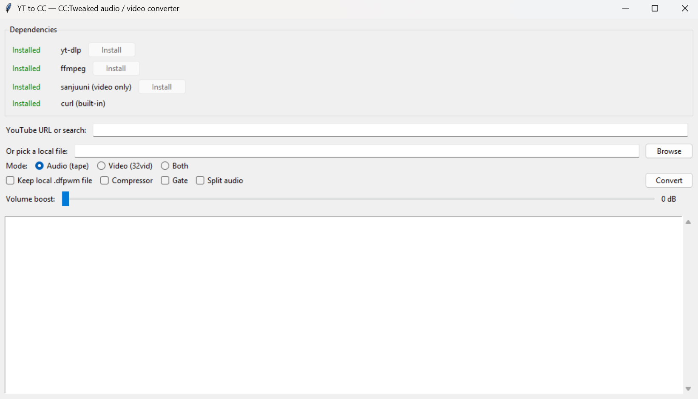

# yt-to-cc

Converts YouTube videos (or local files) into formats that work with CC:Tweaked and Computronics in Minecraft.

**Audio** gets turned into `.dfpwm` for Computronics tapes. **Video** gets turned into `.32v` files via sanjuuni for playback on CC monitors.

Everything runs locally — just paste a YouTube link (or browse for a file), hit Convert, and it spits out the in-game commands to run.



## What you need

- Python 3
- [yt-dlp](https://github.com/yt-dlp/yt-dlp) (there's an install button in the app)
- [ffmpeg](https://ffmpeg.org/) (also has an install button)
- [sanjuuni](https://github.com/MCJack123/sanjuuni) for video (install button too)
- curl (comes with Windows 10+)

## Usage

```
python yt_to_cc.py
```

That opens the GUI. Pick audio, video, or both. Paste a YouTube URL, search term, or browse for a local file. Configure your monitor size/scale if doing video. Hit Convert.

It uploads the result to catbox and gives you the `pastebin run` commands to paste into your CC computer.

## Notes

- Videos over 16MB can be split into chunks — check the "Larger than 16" box
- The volume slider, compressor, and gate are there because DFPWM can be quiet
- Monitor size is in blocks (e.g. 3x2), scale 0.5 gives the most pixels
- Local files can be mp3, wav, flac, mp4, mkv, avi, whatever ffmpeg handles
- "Split audio" splits long audio into two halves (auto-splits over 128 min)
